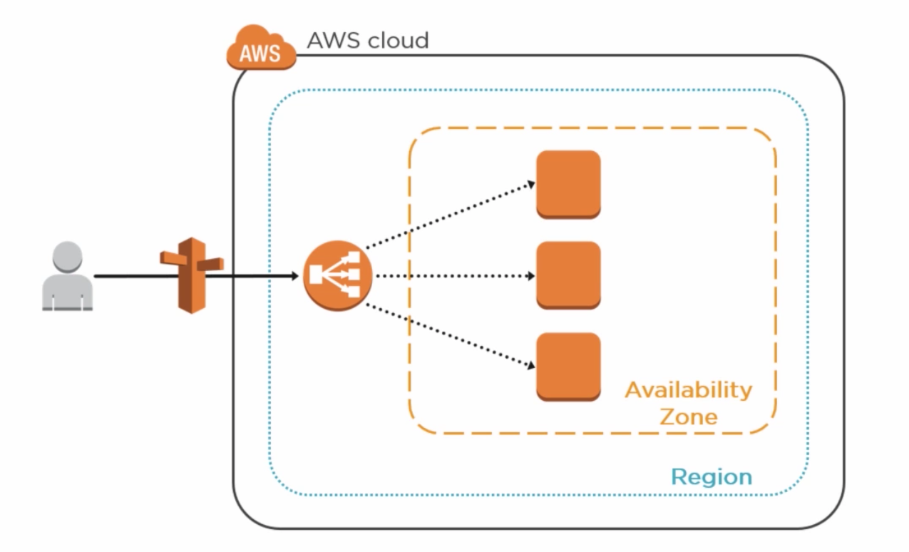
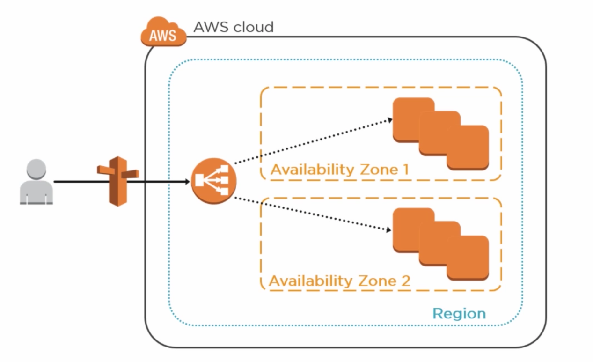
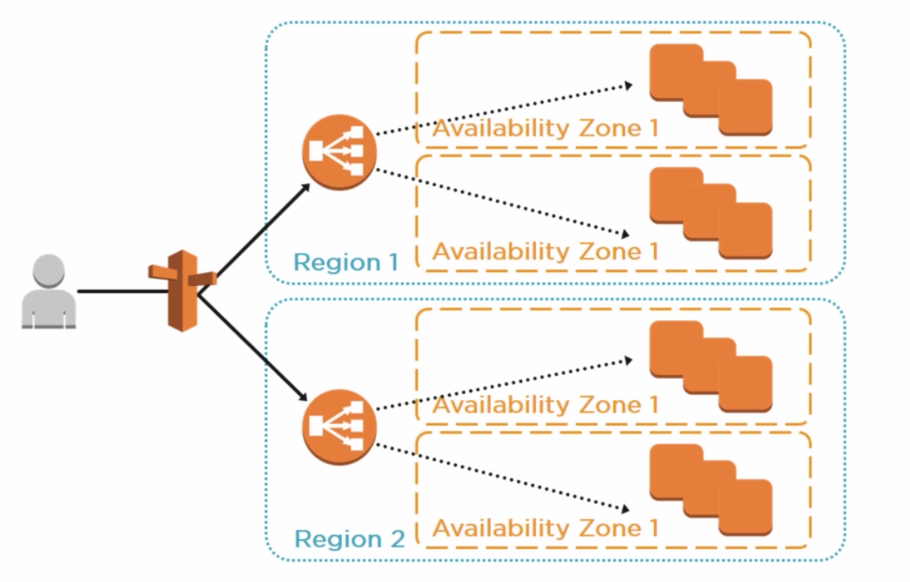
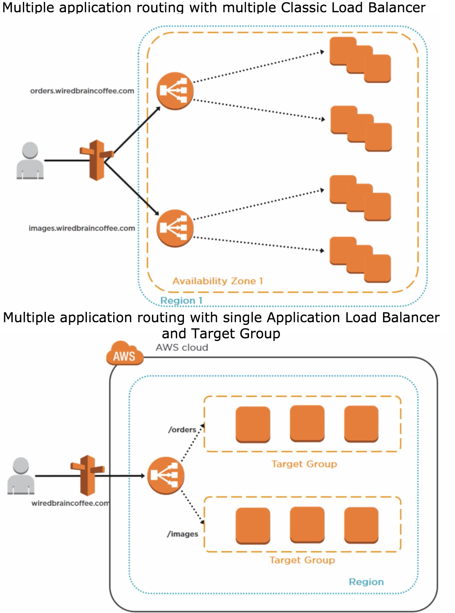

> 39 - 48

## Load balancer ##
- Three types of Load Balancers:
    - Application load balancer (OSI layer 7: HTTP/HTTPS)
    - Network load balancer (OSI layer 4: TCP)
    - Classic load balancer (old Elastic Load Balancer ELB)
        - Usually works on layer 4, but can also be configured (with x-forwarded-for) to work on layer 7.

* X-Forwarded-For Header: Your load balancer forwards the public ipv4 ip address of the original request to the WebService instance on your cloud.

* Error 504: The gateway timeout error. Underneath application is not responding, so the loadbalancer sends 504 to the user on timeout.

**Elastic Load Balancer (Classic Load Balancer)**
- Supported Ports:
    - 25 SMTP
    - 80/443 HTTP/HTTPS
    - 1024-65535

* You can't assign a public IP address to your ELB, only works with DNS names. And Route53 resolves the DNS name of an ELB and transfers the traffic.
* You can integrate ELB with CloudTrail for log security analysis.
* 1 SSL Certificate per ELB. Multiple SSL certificate require multiple ELB.
* WildCard certificates are supported.
    * You can have a Certificate for `*.mysite.com`. In that case all sub-domains will be supported with the Certificate.
    * However, if you create a Certificate for `blog.mysite.com` then you will have to have different certificate for all other sub-domains. e.g. `dev.mysite.com`

* Load Balancer is a Region wide service, and it is a AWS provided service, you don't have to maintain high availability, or scalability. You can apply multiple ELB in a single region, but it won't bring much because if there is a platform issue then that issue would effect all your ELBs. And since ELB is a AWS service and AWS takes care of scaling and availability you don't need to do it yourself.

* You can have a single ELB that balances load across Availability Zones. Remember ELB is Region wide.

* And since you can apply Wild Card certificate, you can operate your service with only one Wild Card SSL certificate. But if you want to have a different SSL Certificate for a particular domain, then you have to deploy another ELB.

- DNS Based Load Balancing: If a particular region goes down, Route53 could route the traffic to another region.

* While setting up the Load Balancer you can setup it in a way that it will transfer traffic to the instances on different AZ, or it will transfer traffic to the AZ disregarding the number of instances in that AZ.

## Load balancer Lab ##
* One Subnet = One AZ

* For Elastic Load Balancer/Application Load Balancer you won't get a public ip address. You will only get a DNS name. IP for ELB is maintained by Amazon itself because it changes time to time.

- Creating a load balancer:
    - Provide the health check html page to ping
    - Number of failed requests before marking an instance out of service.
    - Time interval between requests.
    - Number of successful request before marking the instance live again.

**Read ELB FAQ**

**Application Load Balancer**
Characteristics
- Layer 7 Only
- Content-based routing: Point to different application behind the LB.
- Supports Micro-services and Containers:
- Integrates with Elastic Container Service (ECS)
- Better performance with real time streaming.
- Reduced hourly cost + reduced number of LB which costs less.
- Health Check + CloudWatch

**Path Based Routing (feature of Application LB)**
If you have multiple applications (orders and images) hosted in separate set of instances and you want to redirect your traffic based on sub-domains (order.mysite.com and images.mysite.com) then in the past you would have to use two ELBs to balance requests.
But with Application Load Balancer solution: you could group instance sets into Target Groups and use a single Application LB and redirect traffic based on sub-domains for target groups.

Target groups can be either bunch of EC2 instances or bunch of Containers. You can't mix and match EC2 and Containers.

## Cloud Watch ##
**Monitoring service for your AWS services (ApplicationELB | EBS | EC2 | ELB | S3)**

- Basic monitoring: Refresh every 5 minutes.
    Services -> EC2 -> Instances -> (Bottom tabs) Monitoring
- Detailed Monitoring (Paid): Refresh every minute.
    Services -> Management Tools -> CloudWatch

    * Dashboards
        - Line | Stacked area | Number |Text
        - Default EC2 Matrices types:
            - CPU *
            - Disk *
            - Network *
            - Status *
            * You can add other widgets manually (e.g. RAM)

    * Alarms: Receive an alarm (email/...) every time something happens

    * Events: When resources changes state
        - e.g. When your EC2 instance come to live an event is generated and a defined lambda function is invoked, who updates your DNS entries.

    * Logs:
        - It installs an agent to your EC2 instance
        - That agent passes monitoring log to the CloudWatch
        - Then we can monitor that inside CloudWatch Logs.

    * Matrices
        - Instead of creating widgets you can come to this menu and view different usage/status matrices here.

**CloudWatch vs CloudTrail**
    - CloudWatch is for performance monitoring and performance logging.
    - CloudTrail is for auditing, to monitor the whole cloud environment.
        - e.g. if you create a new user, a new role, a new s3 bucket ...

## AWS Command Line (CLI) ##
- AWS CLI Available commands:
    - cp
    - ls
    - mb    <!-- make a bucket -->
    - mv    <!-- move a bucket -->
    - presign
    - rb
    - rm

- In your EC2 home directory you'll find .aws folder, where you'll find your aws configurations and credentials.

- Destruct your EC2 instance from SSH
    - `aws ec2 describe-instances`
    - Find the InstanceId
    - `aws ec2 terminate-instances  --instance-id <InstanceId>`

## IAM Roles ##
Instead of using Secret Access Key to access EC2 from CLI, setup a Roles that has access to your EC2, and use only your PrivatePublic key to login to the EC2.
It won't store any credentials into ~/.aws directory.

* You can assign or remove roles later after creating and launching the EC2 instance.

## S3 CLI & Regions ##
- Via EC2 CLI, if you want to copy objects from a S3 bucket which is located in a different region than your EC2 instance, better add the --region argument. Otherwise some times it doesn't work.
    - `aws s3 cp --recursive  s3://bucket-apsoutheast2 /home/ec2-user --region eu-west-2`

## Accessing Metadata from CLI (IMPORTANT) ##
- Accessing metadata of our EC2 instance
    `ssh ec2-user@<IP ADDRESS> -i <EC2_KEYPAIR.pem>`

    `curl http://169.254.169.254/latest/meta-data/`

    `curl http://169.254.169.254/latest/meta-data/public-ipv4`

    `curl http://169.254.169.254/latest/meta-data/public-ipv4 > mypublicip.html`

*Thus we can access our instance information and write it to a file on the same instance or write to our S3 instance or update our dns server.*

- Access user-data aka used bootstrap script of the EC2 instance.
    `curl http://169.254.169.254/latest/user-data/`

## Launch Configuration and Auto Scaling Groups ##
**There are three main components in Auto Scaling:**
- Auto Scaling Group
- Launch Configuration
- Scaling Plans

**Create your first Auto Scaling Group**
- Create our health check text: which is just a html file we will track if exists or not.
- Put this file in our S3 bucket.
- Now create an ELB which checks the healthcheck.html file to be sure if our instance is live or not.
- Create a Auto Scaling Group
    - It requires a Launch Configuration. So lets create one.
        - Add the bootstrap script to install apache server, and copy the index.html and healthcheck.html file from S3 bucket to /var/www/html/.
            `#!/bin/bash`
            `yum install httpd -y`
            `yum update -y`
            `aws s3 cp s3://YOURBUCKETNAMEHERE /var/www/html/ --recursive`
            `service httpd start`
            `chkconfig httpd on`
        - IP Address Type: Only assign a public IP address to instances launched in the default VPC and subnet. (Default)

    *(back to create auto scaling group)*
    - (Group details)
    - Group name:
    - Group size: 3
    - Network:
    - Subnet: Choose all AZ
    - Advanced:
        - Load Balancer:
        - Health check type: ELB. (Health check of EC2 or ELB?)
        - Health check grace period: when it should star checking health. since we install apache and copy contents from s3, we need some time to prepare our EC2 instances. so provide some time to do that stuff: 180s
    - (Scaling policy: Increase)
    - Execute policy when: Set Alarm: Average CPU utilization > 90% for consecutive period of 5 mins
    - Take the action: add 1 instance
    - Instances need: some time to warm up the instance: 300
    - (Decrease)
    - Execute policy when: Set Alarm: Average CPU utilization < 90% for consecutive period of 5 mins
    - Take the action: remove 1 instance
    **As soon as you finish creating a Auto Scaling Group it starts performing. So you'll able to see 3 EC2 instances are starting up.**
    - Grab the DNS name of the Auto Scaling Group and paste it to your browser. You'll be able to see the index.html of one of your 3 EC2 instances. You can go to the ip address of your EC2 instances individually and check it as well.

    - Now kill 2 of your 3 EC2 instances. You'll see you can't see index pages of those instances but your Auto Scaling Group's DNS name still serves the index page. The ASG takes some time to figure out that some instances are down and it starts new instances automatically.

## EC2 Placement Group (IMPORTANT) ##
Grouping of instances.

Two types of Placement Groups:
- Clustered Placement Group (IMP):
    - Grouping of instances within a single AZ.
    - Offers low network latency and/or high network throughput. e.g. application: Cassandra cluster, Big Data cluster.
    *Only certain instances can be launched in to a Clustered Placement Group. Usually instances with high computation or RAM are allowed.*
- Spread Placement Group:
    - Group of instances placed distinct underlying hardware. Instances that should be kept separate from each other.
