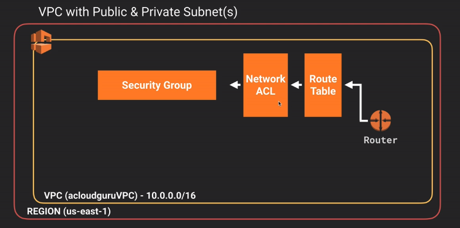
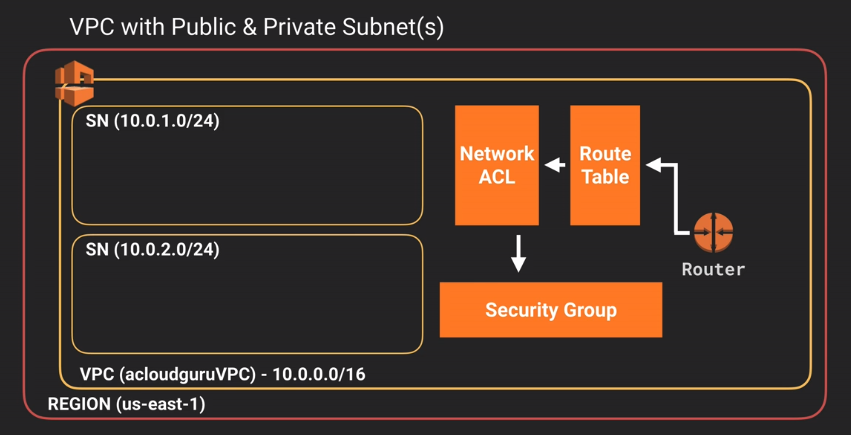
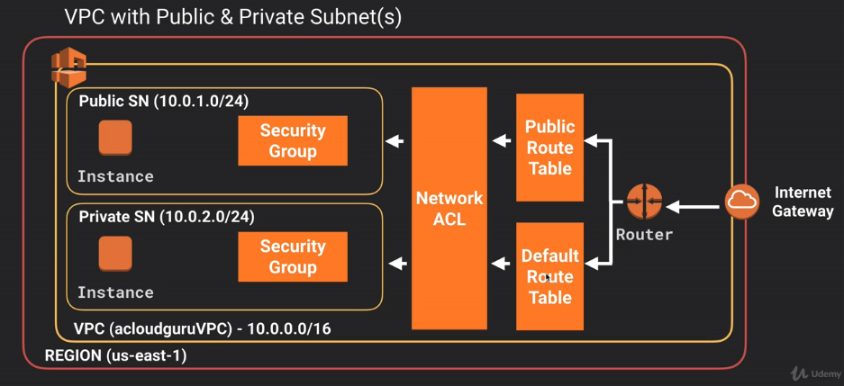
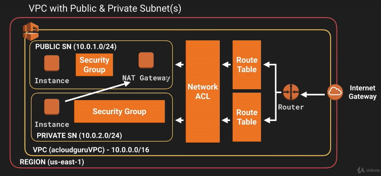

### VPC 101 ###
- 1 Subnet = 1 Availability Zone
- AWS Subnet Classes:
    - 10.0.0.0 - 10.255.255.255 (10/8 prefix)               Subnet mask: 255.0.0.0
    - 172.16.0.0 - 172.31.255.255 (172.16/12 prefix)        Subnet mask: 255.240.0.0
    - 192.168.0.0 - 192.168.255.255 (192.168/16 prefix)     Subnet mask: 255.255.0.0

- Once you create a new VPC, you get these created automatically:
    - XX

**What you can do with a VPC**
- You can launch an instance into a subnet of your choosing.
- Assign custom IP address ranges in each subnet.
- Configure route tables between subnets.
- Create internet gateway and attach it to your VPC.
    - You can have only one internet gateway per VPC
- Create a Security group
    - Security Group can span multiple AZ
- Subnet network access control list (ACLS)

**Default VPC vs Custom VPC**
- All subnets in default VPC have a route out to the internet.
- All EC2 instances inside default VPC gets private and public IP address. EC2 inside custom VPC gets private IP address by default.

**VPC Peering**
- You can peer VPCs via direct network route using private IP addresses.
    - VPCs from different subnets can connect to each other as well using private ip addresses.
    - VPCs from different accounts also can connect using private ip addresses.
- VPC peering connections has to be direct.
    - A -> B -> C doesn't give access from A -> C
    - you have to peer A -> C separately.

**Tips**
- 1 Subnet = 1 AZ
- Security Groups are Stateful:
    - If you open port 80 of your security group, you'll be able to send and receive through.
- Network Access Control Lists are Stateless
    - If you open port 80 for inbound only, you won't be able to send traffic through port 80. you have to add outbound rule explicitly.

### VPC Lab 1 ###
We are going to create a VPC with two Subnets. One Subnet will have internet access (through internet gateway) and the other Subnet won't have internet access. Later, we'll create two EC2 instances in this two subnets and we'll verify their internet availability.

Required components:
- 1 VPC
- 2 Subnets
- 1 Internet Gateway
- 1 Default Route Table + 1 Custom Route Table
- 1 Default Security Group + 1 Custom Security Group (with ssh & http)
- 2 EC2 instances

**Create your own VPC**
- *Create VPC*
    - Provide IPv4 CIDR: 10.0.0.0/16 (max host ip range)

* As soon as you create your own VPC, these are created automatically:
    - 1 Route Table
    - 1 Network Access Control List (NACL)
    - 1 Security Group (default)
    -
    - NO Subnet
    - NO Internet Gateway
    - NO NAT Gateway
* Basically it creates a new Route Table and Security stuffs (NACL, Security Group)

- *Create a new Subnet*
    - Provide IPv4 CIDR block: Less or equal to your VPC's IPv4 CIDR. e.g. 10.0.1.0/24
    * First 4 and the last IP addresses of your subnet are reserved:
        - 10.0.0.0: Network address.
        - 10.0.0.1: VPC Router.
        - 10.0.0.2: DNS Server.
        - 10.0.0.3: Future use.
        - 10.0.0.255: Broadcast address. Even though AWS doesn't support broadcasting.
- *Create 2nd Subnet*
    - 10.0.2.0/24

- *Create an Internet Gateway*
    - Once created you have to attach it with your VPC.
    * You can't attach multiple Internet Gateways with 1 VPC.
    * You can't attach 1 Internet Gateway with multiple VPC.

- *Create a new Route Table*
* Default Route Table (created when you create a new VPC):
    - (Routes tab) By default it enables all our subnets to communicate to each other internally (but not to the internet).
    - (Subnet Associations tab) By default all our newly created Subnets are associated with the "main route table". And we don't want to have Internet connection to our "main route table". Because then any new Subnet will be connected to internet, since all newly created subnets are by default associated with the "main route table".
* So lets create a new Route Table and attach IGW with that. then associate those subnets to that route who needs to be connected to the internet.
    - Add Route and select the Internet Gateway as the target.
    - Now, every subnet that are associated with this route will have internet access.
    - For now, I'm going to associate 10.0.1.0 subnet with this new route with internet. and keep 10.1.2.0 subnet as private subnet.

*Before experimenting that scenario, we need to Enable "auto-assign IP address" to our public subnet.*

- *Let's create one EC2 instance in our public subnet and one EC2 instance in our private subnet and check which one has internet*
* Create 2 EC2 instances in two different subnets (10.0.1.0 and 10.0.2.0)

* Security Group don't span over VPC. So while creating our EC2 instances you won't find your other security groups that you used before outside of this new VPC. *You have to create a new security group for every VPC that you create*.
* Chose the newly created security group for the public EC2 instance, and the default security group for the private EC2 instancee (since the private instance wont be accessible from internet)
* You can use the old KeyPair though.

**Even if you select the security group which have ssh & http access, and even if you allow assigning public ip address during EC2 instance creation, you won't be able to access the private instance via ssh, because the subnet the instance belongs to does not have Internet Gateway connection.**

**At this moment our two instances can't communicate to each other because haven't enabled that yet.**

### VPC Lab 2 ###
Here we'll extend our VPC setup, and convert our private subnet to a private RDS, which will be accessed from the EC2 instance of the public subnet.

Required Components:
- 1 New Security Group (with http, https, mysql/arora, all icmp - ipv4) [icmp will allow pinging from public subnet to private subnet]
    - You need to provide the CIDR of our public subnet (10.0.1.0/24) as inbound source of all rules.

- Now update your private EC2 instance's security group and put it into this new security group.
* Now if you ssh to the public EC2 instance and try to ping the private EC2 instance it should work.

### NAT Instances (almost deprecated) & NAT Gateway ###
**NAT Instance**
- NAT Instance works as a Pipe/Tunnel and doesn't initiate or receive traffic (aka. doesn't work as a source or destination). Instead it works as a via. Thats why we must disable NAT Instance's check for source/destination.

In this step we are going to extend the VPC lab, and enable internet access to our private EC2 instance from subnet-2 (10.0.2.0/24) via a NAT Instance.

- Lets create a NAT Instance (from Community AMI) in our public subnet. Don't forget to disable source/destination check of the NAT Instance.
    - Assign the security group Web-DMZ (with ssh, http, https)
    * By being in our public subnet (10.0.1.0/24), it has internet access via our internet gateway.
- Update our default Route Table (our private EC2 instance is connected to that), and add a Route that allows traffic through the NAT Instance.
    - Destination: 0.0.0.0/0
    - Target: NAT Instance

- Now ssh to our public EC2 instance and from their to our private EC2 instance (copy the private key to public EC2 and ssh to private EC2 using that). and try to access internet. you should be able to access the internet.

**NAT Gateway**
NAT Gateway serves the same purpose (pipe/tunnel to pass through requests from other instances). But NAT Gateway is highly available and implemented with redundancy, where for NAT Instance you need a script to manage failover.

To achieve internet access in our private subnet (10.0.2.0/24) we could use NAT Gateway.
- Just create a NAT Gateway in public subnet (10.0.1.0/24), and
- Update the default route table (which is responsible for the private subnet) and add a route (dest: 0.0.0.0/0; target: nat...)
* For NAT Gateway, no need to select security group, its handled by amazon.

**NAT Gateway vs NAT Instance (IMPORTANT)**

### Network Access Control Lists vs Security Groups ###
A network access control list (ACL) is an optional layer of security for your VPC that acts as a firewall for controlling traffic in and out of one or more subnets.
Rules of NACL are similar to the Security Groups. NACL works on top of Subnet, so it gets the hit before Security Group.

* You can connect a subnet to only one NACL. However multiple subnets can be associated with one NACL. (Subnet * - 1 NACL)
* Network Access Control Lists can't span VPCs.
* A custom NACL denies all traffic (inbound and outbound) by default.
* It is stateless: Outbound traffic must be explicitly allowed by rules. (unlike Security group, where if you define inbound rules, outbound rules are also defined)

**Security Group vs Network Access Control Lists**
| Security Group                                                                   | Network ACL                                                                |
| -------------------------------------------------------------------------------- | -------------------------------------------------------------------------- |
| Operates at the instance level                                                   | Operates at the subnet level                                               |
| Supports allow rules only                                                        | Supports allow rules and deny rules                                        |
| Is stateful: Return traffic is automatically allowed, regardless of any rules    | Is stateless: Return traffic must be explicitly allowed by rules           |
| We evaluate all rules before deciding whether to allow traffic                   | We process rules in number order when deciding whether to allow traffic    |
| Applies to an instance only if someone specifies the security group when         | Automatically applies to all instances in the subnets it's associated with |
| launching the instance, or associates the security group with the instance later | (therefore, you don't have to rely on users to specify the security group) |

**Application of a Network ACL**
- Create a NACL, define some allowed and denied inbound rules as well as outbound rules. Remember to put rule number (IPv4: 100; IPv6: 101)
- Inbound rule:
    - Rule#     Type            Protocol    Port range      Source          Allow/Deny
    - 100       HTTP (80)       TCP(6)      80              0.0.0.0/0       Allow
    - 200       HTTPS (443)     TCP(6)      443             0.0.0.0/0       Allow
    - 300       SSH (22)        TCP(6)      22              0.0.0.0/0       Allow
    - *         ALL Traffic     ALL         ALL             ::/0            Deny
    - *         ALL Traffic     ALL         ALL             0.0.0.0/0       Deny
- Outbound rule:
    - Rule#     Type            Protocol    Port range      Destination     Allow/Deny
    - 100       HTTP (80)       TCP(6)      80              0.0.0.0/0       Allow
    - 200       HTTPS (443)     TCP(6)      443             0.0.0.0/0       Allow
    - 300       Custom TCP Rule TCP(6)      1024 - 65535    0.0.0.0/0       Allow       (1024-65535: Ephemeral Port)
    - *         ALL Traffic     ALL         ALL             ::/0            Deny
    - *         ALL Traffic     ALL         ALL             0.0.0.0/0       Deny
- Then associate our public Subnet with the Network ACL. It will automatically remove the public subnet from the default NACL (a subnet can only connect to 1 NACL)

* At this moment our hosted website on public EC2 will be accessible.
* Lets modify our inbound rule to deny HTTP request from particular ip address

- Add this line in Inbound rule:
    - Rule#     Type            Protocol    Port range      Source          Allow/Deny
    - 99        HTTP (80)       TCP(6)      80              YOUR IP/X       Deny
* Now try to access the web page hosted on public EC2. You shouldn't be able to access it. NACL is denying your request. It doesn't even hit Security Group. Thus it works as a firewall.
