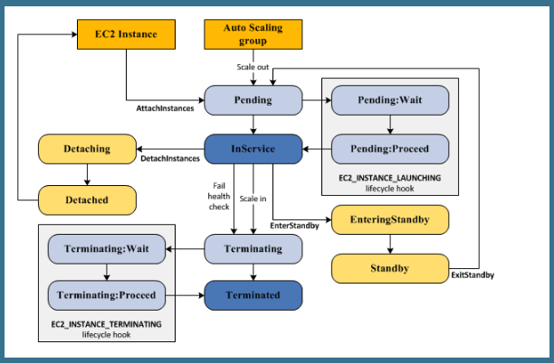

# API Gateway #
- API Gateway connects AWS services and other public or private websites.
- It provides consistent RESTful APIs for mobile and web applications to access AWS services.
- To enable the serverless applications, API Gateway supports *streamlined proxy integrations* with *AWS Lambda* and *HTTP endpoints*.

- There are two kinds of developers who use API Gateway: app developers and API developers.
- The API developer must be an IAM user in the AWS account that owns the API.
- The app developer does not need to have an AWS account, provided that the API either does not require IAM permissions or supports authorization of users through third-party identity providers supported by Amazon Cognito identity federation.

- The base URL of an API in a given stage ({stageName}) is of the following format:
    - `https://{restapi-id}.execute-api.{region}.amazonaws.com/{stageName}`
- With a custom domain name the base URL:
    - `https://{api.example.com}/{basePath}`

**Throttle:**

*Error 429: 429 Too Many Requests error*

As an API developer, you can set the limits for individual API stages or methods to improve overall performance across all APIs in your account. Alternatively, you can enable usage plans to restrict client request submissions to within specified request rates and quotas. This restricts the overall request submissions so that they don't go significantly past the account-level throttling limits.

To include API methods in a usage plan, you must configure individual API methods to require an API key. For user authentication and authorization, don't use API keys. Use an IAM role, a Lambda authorizer, or an Amazon Cognito user pool.

**Issues:**
- API paths of /ping and /sping are reserved for the service health check. Use of these for API root-level resources with custom domains will fail to produce the expected result.
- The plain text pipe character (|) is not supported for any request URL query string and must be URL-encoded.
- API Gateway does not support wild-card subdomain name (of the *.domain form). However, it support wild-card certificates, namely, a certificate for a wild-card subdomain name.
- API Gateway currently limits log events to 1024 bytes.

**CORS:**
CORS-required response headers:
- Access-Control-Allow-Methods
- Access-Control-Allow-Headers
- Access-Control-Allow-Origin

# AutoScaling #
Auto Scaling selects an instance to terminate as follows:
- Terminates instance from AZ with the most instances and al least one instance that is not protected from scale in.
- Terminates instance from AZ with the oldest launch configuration.

Autoscaling group replaces an instance when that auto scaling group uses both EC2 and ELB health checks and when one of the ELBs reports an instance as unhealthy.

The rule of thumb, if any instance reported unhealthy either by Auto scaling health check or by any ELB instance check (In case of multiple ELB), Auto scaling will consider worst case scenario and always mark instance unhealthy and remove it.

If you configure your Auto Scaling group to determine health status using both EC2 status checks and Elastic Load Balancing health checks, Auto Scaling considers the instance unhealthy if it fails either the status checks or the health check.
Note that if you attach multiple load balancers to an Auto Scaling group, all of them must report that the instance is healthy in order for Auto Scaling to consider the instance healthy. If one load balancer reports an instance as unhealthy, Auto Scaling replaces the instance, even if other load balancers report it as healthy.

**Lifecycle Hook:**
Lifecycle hooks enable you to perform custom actions by pausing instances as an Auto Scaling group launches or terminates them. For example, while your newly launched instance is paused, you could install or configure software on it.

**Cooldown period:**
The cooldown period is a configurable setting for your Auto Scaling group that helps to ensure that it doesn't launch or terminate additional instances before the previous scaling activity takes effect. After the Auto Scaling group dynamically scales using a simple scaling policy, it waits for the cooldown period to complete before resuming scaling activities.

If an instance becomes unhealthy, the Auto Scaling group does not wait for the cooldown period to complete before replacing the unhealthy instance.

# Security Token Service (STS) (Professional)#
The AWS Security Token Service (STS) is a web service that enables you to request temporary, limited-privilege credentials for AWS IAM users or for users that you authenticate (federated users).

* Enterprise Identity Federation:
- SAML 2.0
- LDAP, AD FS
- Single Sign-On

* Web Identity Federation:
- Amazon
- Facebook
- Google
- OpenID

* Cross Account Access

The following actions are supported with STS:
- AssumeRole:                   General AssumeRole
- AssumeRoleWithSAML:           Used for federated access if you have on-premise identity store.
- AssumeRoleWithWebIdentity:    Used for mobile or web application with a web identity provider.

- DecodeAuthorizationMessage:
- GetCallerIdentity:
- GetFederationToken:
- GetSessionToken:

**Terminology**
- Federation: A group of users from directly connected from different directory service. i.e. connecting users form IAM with users from Active Directory.
- Identity Broker: A trusted third party broker, to federate multiple users from different directory services.
- Identity Store: A list of users. i.e. Amazon, Google, Facebook.
- Identities: Users.

# Elastic Container Service (ECS) #
Following scenarios are ideal for using the ECS:
- Continuous integration
- Continuous Deployment
- MicroService

# CloudTrail #
A trail that applies to all regions has the following advantages:
- The configuration settings for the trail apply consistently across all regions.
- You receive CloudTrail events from all regions in a single S3 bucket and optionally in a CloudWatch Logs log group.
- You manage trail configuration for all regions from one location.
- You immediately receive events from a new region. When a new region launches, CloudTrail automatically creates a trail for you in the new region with the same settings as your original trail.
- You can create trails in regions that you don't use often to monitor for unusual activity

* By default, the log files delivered by CloudTrail to your bucket are encrypted by Amazon SSE-S3 (server side encryption, managed by S3).
* You can also opt to encrypt files using AWS SSE-KMS (server side encryption, managed by KMS)

# VPC Peering #
- You cannot create a VPC peering connection between VPCs with matching or overlapping IPv4 CIDR blocks (i.e. VPCA: 10.0.0.0/16; VPCB: 10.0.0.0/16;)
-

# NAT Gateway #
How to enable instances in your private subnet to communicate with the Internet?
- An Elastic IP needs to be assigned to the NAT gateway.
- Update the route table associated with one or more of your private subnets to point Internet-bound traffic to the NAT gateway.

* NOTE: You can not route traffic to a NAT gateway through a VPC peering connection, a VPN connection, or AWS Direct Connect.

* NOTE: You can not grant a user permission to perform specific API operations on the NAT gateway. Once given, given the full permission.
